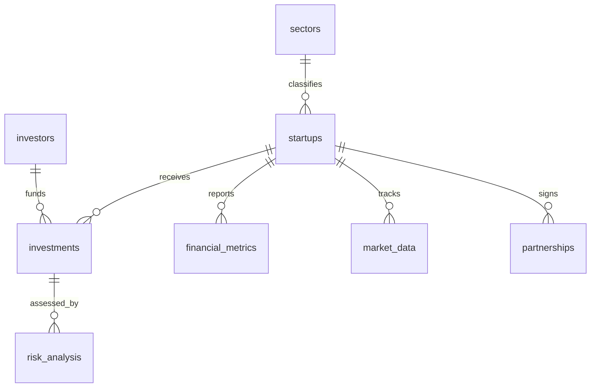

# Startup Investment Analysis & Decision System

## 1. Delivery Summary

The original frontend was a static dashboard driven entirely by `assets/js/mockData.js`. This implementation converts it into a data-backed system with:

- a MySQL 8 schema grounded in the earlier normalized investor-startup-investment model
- realistic Indian startup ecosystem sample data
- API endpoints that serve every existing page and chart
- views, triggers, stored procedures, complex joins, and subqueries ready for DBMS evaluation

The backend is intentionally MySQL-first because it integrates directly with the Node.js service layer and the existing browser UI without introducing a second application stack. The Oracle version in `~/Downloads/startup_dbms_project` was used as the conceptual baseline for normalization and relationship design.

## 2. ER Diagram Description

Entity notes:

- `sectors` is the master classification table and prevents sector names from being repeated inside startup rows.
- `investors` stores profile, risk appetite, and capital capacity.
- `startups` stores the master company profile and current valuation summary.
- `investments` is the fact table that resolves the many-to-many relationship between investors and startups.
- `financial_metrics` stores month-level operating performance, including the added CAC, LTV, burn, runway, and churn fields.
- `market_data` stores periodic market and competitor signals for each startup.
- `partnerships` captures external commercial validation like LOIs and pilots.
- `risk_analysis` stores investment-level risk snapshots and is refreshed automatically when burn or churn changes.

## 3. Normalization Walkthrough

### 1NF

Every table stores atomic values only:

- one startup row contains one sector reference, one city, one stage, and one valuation snapshot
- one financial row contains metrics for exactly one startup and one reporting month
- one partnership row contains one partner and one deal type

There are no repeating groups such as comma-separated investors, sectors, or month bundles inside single columns.

### 2NF

All non-key columns depend on the whole primary key:

- in `financial_metrics`, revenue, CAC, LTV, burn, runway, and churn depend on the single row identified by `metric_id`
- the uniqueness rule `(startup_id, metric_month)` prevents duplicate period entries without moving descriptive startup data into the metric table
- `risk_analysis` attributes depend on `risk_id`, while `investment_id` remains a foreign key rather than part of an overloaded composite row

### 3NF

Transitive dependencies were removed:

- sector details live only in `sectors`
- investor characteristics live only in `investors`
- startup descriptive data lives only in `startups`
- recurring operational data lives only in `financial_metrics`
- partnership and market signals were split from startup master data because they change on different timelines

### BCNF

The design also satisfies BCNF for the main operational tables because every determinant is a candidate key or an enforced alternate key:

- `sector_name` is unique in `sectors`
- `startup_name` and `investor_name` are unique natural business identifiers
- `(startup_id, metric_month)` and `(startup_id, market_date)` are alternate keys for time-series tables

That keeps the schema stable even when analysts add more months, more investors, or more rounds.

## 4. Advanced SQL Design Rationale

### Complex joins

The join set in [database/advanced_queries.sql](/Users/kavaykhurana/Desktop/dbms_startup/startup-investment-system/database/advanced_queries.sql) is built around the way an investment committee actually reasons:

- investor quality is not meaningful without the startup, the round, and current operating metrics
- financial efficiency needs context from both market pressure and partnership proof points
- runway stress is only actionable when tied back to the specific investors exposed to that risk

That is why the joins deliberately cross `startups`, `investments`, `investors`, `financial_metrics`, `market_data`, `partnerships`, and `risk_analysis` instead of stopping at simple lookup relationships.

### Correlated subqueries

The subqueries answer “relative” questions rather than absolute ones:

- Is this burn rate high for *this sector*?
- Is this LTV/CAC ratio strong compared with direct peers?
- Is this investor deploying more capital than others of the same type?

That is the correct use of correlated logic here because the benchmark changes with the row being evaluated.

### Views

- `vw_TopStartups` isolates startups whose latest LTV/CAC ratio is already investable.
- `vw_HighRiskAlerts` isolates runway pressure before it shows up as a missed financing milestone.

The views are intentionally operational, not decorative. They reduce repeated filtering logic in both SQL demos and API work.

### Trigger design

- `trig_EquityCheck` blocks cap-table over-allocation before the row is written.
- `trig_RiskUpdate` keeps risk scores synchronized with the latest burn, churn, and runway state.

This keeps critical integrity rules inside the database rather than trusting the application layer alone.

## 5. Recommendation Scoring Algorithm

`sp_GetRecommendation` ranks startups using three weighted inputs from the latest operating snapshot:

- `50%` LTV/CAC ratio
- `20%` CAC efficiency relative to the highest CAC in the cohort
- `30%` inverse risk score

Why this mix:

- LTV/CAC gets the highest weight because it is the clearest signal of capital efficiency and retention quality.
- CAC still matters independently because two startups can have similar ratios but very different acquisition burdens.
- Risk is weighted heavily enough to prevent the system from recommending a high-growth company with a fragile runway or churn problem.

The procedure returns the top 5 opportunities with:

- rank
- startup identity
- sector and stage
- LTV/CAC ratio
- risk score
- decision score on a 10-point scale
- signal: `INVEST`, `WATCH`, or `AVOID`
- explanation text for the recommendation card

## 6. Data Mapping to the Existing Frontend

| Frontend target | API source | SQL origin |
| --- | --- | --- |
| `index.html#total-startups` | `/api/dashboard.summary.totalStartups` | `COUNT(startups.startup_id)` |
| `index.html#total-funding` | `/api/dashboard.summary.totalFundingInr` | `SUM(investments.invested_amount_inr)` |
| `index.html#avg-roi` | `/api/dashboard.summary.avgROI` | profit-run-rate ROI derived from latest `financial_metrics.net_profit_inr` and `investments.equity_percentage` |
| `index.html#risk-level` | `/api/dashboard.summary.riskLevel` | average latest `risk_analysis.risk_score` mapped to Low/Medium/High |
| Dashboard sector chart | `/api/dashboard.sectorGrowth` | `market_data.simulated_trend_value` grouped by `sectors.sector_name` |
| Dashboard trend chart | `/api/dashboard.investmentTrends` | `investments.invested_amount_inr` grouped by month |
| Startups table name | `/api/startups.items[].name` | `startups.startup_name` |
| Startups table sector | `/api/startups.items[].sector` | `sectors.sector_name` |
| Startups table stage | `/api/startups.items[].fundingStage` | `startups.funding_stage` |
| Startups table total funding | `/api/startups.items[].totalFunding` | `SUM(investments.invested_amount_inr)` per startup |
| Startups table risk badge | `/api/startups.items[].riskLevel` | latest `risk_analysis.risk_score` converted to Low/Medium/High |
| Details page title | `/api/startups/:id.startup.name` | `startups.startup_name` |
| Details page stage badge | `/api/startups/:id.startup.fundingStage` | `startups.funding_stage` |
| `details.html#val-cac` | `/api/startups/:id.startup.cac` | latest `financial_metrics.cac_inr` |
| `details.html#val-ltv` | `/api/startups/:id.startup.ltv` | latest `financial_metrics.ltv_inr` |
| `details.html#val-burn` | `/api/startups/:id.startup.burnRate` | latest `financial_metrics.burn_rate_inr` |
| `details.html#val-runway` | `/api/startups/:id.startup.runway` | latest `financial_metrics.runway_months` |
| Details history chart | `/api/startups/:id.financialHistory` | monthly `financial_metrics.revenue_inr` |
| Recommendation cards | `/api/recommendations.items[]` | `sp_GetRecommendation()` |
| Analytics scatter chart | `/api/analytics.scatter.points[]` | latest `financial_metrics.cac_inr` and `financial_metrics.ltv_inr` |
| Analytics burn vs runway chart | `/api/analytics.burnRunway` | latest `financial_metrics.burn_rate_inr` and `financial_metrics.runway_months` |
| Analytics radar chart | `/api/analytics.radar` | sector aggregates from `market_data`, `risk_analysis`, `partnerships`, and `investments` |

## 7. System Architecture

Flow:

1. Browser loads the existing HTML page from the Node/Express server.
2. Page-specific frontend modules call JSON endpoints such as `/api/dashboard` or `/api/recommendations`.
3. Express routes invoke repository functions in `backend/repository.js`.
4. Repository functions execute MySQL queries, views, or stored procedures.
5. The API reshapes the result into the exact structure expected by the DOM and Chart.js.
6. The frontend renders KPIs, tables, and charts without any mock objects.
7. Decision-makers see an integrated view of startup efficiency, market momentum, risk, and capital deployment.

In short:

`Frontend HTML/JS -> Express API -> MySQL schema/procedures/views -> analytics payload -> investor decision UI`

## 8. Files Added for Delivery

- [server.js](/Users/kavaykhurana/Desktop/dbms_startup/startup-investment-system/server.js)
- [backend/db.js](/Users/kavaykhurana/Desktop/dbms_startup/startup-investment-system/backend/db.js)
- [backend/repository.js](/Users/kavaykhurana/Desktop/dbms_startup/startup-investment-system/backend/repository.js)
- [database/mysql_startup_investment_system.sql](/Users/kavaykhurana/Desktop/dbms_startup/startup-investment-system/database/mysql_startup_investment_system.sql)
- [database/advanced_queries.sql](/Users/kavaykhurana/Desktop/dbms_startup/startup-investment-system/database/advanced_queries.sql)

## 9. Operational Note

If you later need Oracle delivery as well, the current relational design already maps cleanly to PL/SQL. The only real migration work would be syntax-level changes for identity columns, triggers, procedures, and view definitions. The entity model and normalization logic would remain the same.
