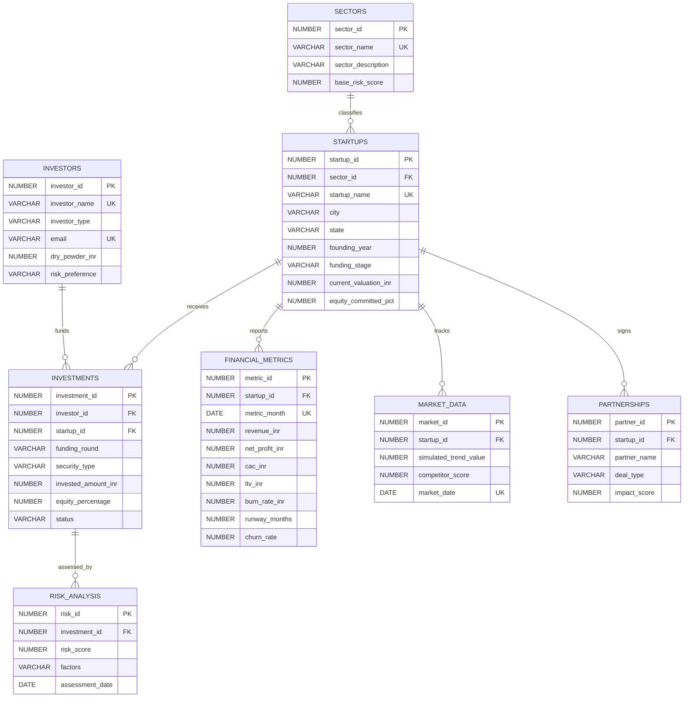

# Startup Investment Analysis & Decision System

This guide is written for explaining the project during a DBMS viva. Use it as your talking script.

## 1. One-Minute Explanation

This project is a Startup Investment Analysis and Decision System. It helps an investor compare startups using funding, sector, customer acquisition cost, lifetime value, burn rate, runway, churn, partnerships, market trend, and risk score.

The frontend is a multi-page analytics dashboard. The backend exposes API routes. The database stores normalized data and contains views, triggers, stored procedures, complex joins, and correlated subqueries.

## 2. System Flow

```text
Frontend pages
-> JavaScript API calls
-> Node/Express or Vercel API
-> SQL database/repository layer
-> analytics payload
-> charts, tables, recommendations, and decision cards
```

In simple words: the user clicks a dashboard page, JavaScript asks the backend for data, the backend reads SQL tables, and the frontend displays investor-friendly analytics.

## 3. ER Diagram



## 4. Entity Explanation

| Table | Purpose |
| --- | --- |
| `sectors` | Master table for sector names like Fintech, Edtech, SaaS, Healthtech. |
| `investors` | Stores investor profile, type, city, risk preference, and available capital. |
| `startups` | Stores core startup details such as name, city, stage, valuation, and sector. |
| `investments` | Connects investors and startups. This is the main transaction/fact table. |
| `financial_metrics` | Stores monthly revenue, profit, CAC, LTV, burn rate, runway, and churn. |
| `market_data` | Stores market trend and competitor pressure for each startup. |
| `partnerships` | Stores validation signals such as LOI or Pilot deals. |
| `risk_analysis` | Stores risk score snapshots for each investment. |

## 5. Cardinality

| Relationship | Meaning |
| --- | --- |
| `sectors 1:N startups` | One sector can contain many startups. |
| `startups 1:N investments` | One startup can raise multiple investments. |
| `investors 1:N investments` | One investor can fund many startups. |
| `startups 1:N financial_metrics` | One startup has many monthly metric rows. |
| `startups 1:N market_data` | One startup has many market snapshots. |
| `startups 1:N partnerships` | One startup can have multiple partners. |
| `investments 1:N risk_analysis` | One investment can have repeated risk assessments over time. |

## 6. Normalization Walkthrough

### 1NF

Every column has atomic values. For example, startup city, sector, stage, CAC, and LTV are separate columns. There are no comma-separated lists of investors or metrics.

### 2NF

Every non-key attribute depends on the full key. Financial values such as revenue, CAC, LTV, burn rate, runway, and churn depend on the metric row and startup reference, not on only part of a larger mixed record.

### 3NF

Transitive dependencies are removed. Sector names are not repeated in every startup row; they live in `sectors`. Investor details are not repeated in investments; they live in `investors`. Startup operating metrics are separated into `financial_metrics`.

### BCNF

Important determinants are candidate keys. `sector_name`, `startup_name`, and `investor_name` are unique. Time-series uniqueness is enforced by combinations like `(startup_id, metric_month)` and `(startup_id, market_date)`.

## 7. Important Constraints

| Constraint | Why it matters |
| --- | --- |
| Primary keys | Uniquely identify every row. |
| Foreign keys | Enforce relationships between sector, startup, investor, investment, and risk. |
| Unique constraints | Prevent duplicate startup names, investor names, and duplicate monthly metric rows. |
| Check constraints | Prevent invalid values such as negative funding, invalid risk score, or equity above 100%. |
| Indexes | Improve joins and filtering on common fields like startup, sector, and metric month. |

## 8. Views

### `vw_TopStartups`

This view filters startups with strong LTV/CAC and healthy runway. It is useful for showing investable companies quickly.

### `vw_HighRiskAlerts`

This view filters startups with low runway, high churn, or high risk. It is useful for investor warnings.

## 9. Triggers

### `trig_EquityCheck`

This trigger ensures that total active equity sold by a startup never crosses 100%. It protects cap-table integrity.

### `trig_RiskUpdate`

This trigger updates risk score when burn rate, churn rate, or runway changes. It shows that business risk is not manually maintained only by the frontend.

## 10. Stored Procedures

### `sp_CalculateROI`

Input: `investment_id`

Output: ROI percentage

It uses latest net profit, investor equity percentage, and invested amount.

### `sp_GetRecommendation`

Output: top recommended startups.

The scoring logic uses:

| Factor | Reason |
| --- | --- |
| LTV/CAC | Shows unit economics and customer value. |
| CAC efficiency | Penalizes expensive acquisition. |
| Risk score | Prevents risky startups from ranking too high. |
| Runway | Shows survival time before next funding requirement. |

## 11. Five Queries to Demonstrate

1. Highest ROI investors in Fintech.
2. Startups whose burn rate is above their sector average.
3. Startups with high LTV/CAC ratio.
4. Investor diversification by sector.
5. High-risk startups with short runway.

The key point to explain: these queries are not simple select statements. They combine joins, aggregation, subqueries, grouping, and business logic.

## 12. Frontend Pages

| Page | What to explain |
| --- | --- |
| Dashboard | KPIs, sector growth, funding trends, risk distribution, top signals. |
| Startups | Search, filters, full portfolio table, Add Startup button. |
| Details | Company profile, metrics, valuation, risk, and revenue history. |
| Recommendations | Ranked investment suggestions from scoring logic. |
| Analytics | CAC vs LTV, burn vs runway, risk by sector, valuation vs funding. |
| DBMS Docs | ER diagram, PL/SQL snippets, normalization, demo order. |

## 13. Best Viva Answer for "Why This Schema?"

The schema separates master data, transaction data, and time-series analytical data. Startups and investors are master entities. Investments are transactions. Financial metrics, market data, partnerships, and risk analysis change over time, so they are stored in separate tables. This design avoids redundancy, supports historical analysis, and makes advanced SQL queries meaningful.

## 14. Best Viva Answer for "How Is Recommendation Calculated?"

The system ranks startups using risk-adjusted investment logic. A startup with high LTV/CAC is attractive because each customer is worth more than the acquisition cost. A low CAC improves capital efficiency. A low risk score and longer runway reduce downside risk. The procedure combines these factors into a score and returns the top startups.

## 15. Demo Script

1. Open the dashboard and say: "This is the investor view."
2. Open Startups and search for "Fintech" or filter by "Low" risk.
3. Click Add Startup and add a sample company.
4. Open a startup detail page and explain CAC, LTV, burn rate, runway, and churn.
5. Open Recommendations and explain the scoring logic.
6. Open Analytics and explain graph-based decision support.
7. Open DBMS Docs and show the ER diagram, PL/SQL trigger, stored procedure, and complex join.
